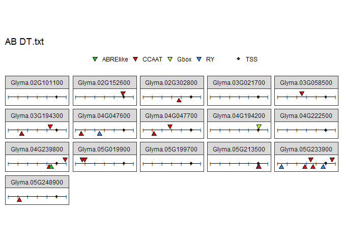

# TEST
Leonardo Jo  
June 12, 2017  


```r
# Promoter Mapping v1.3
## install.packages("tidyverse")
library(tidyverse)
```

```
## Warning: package 'tidyverse' was built under R version 3.3.3
```

```
## Loading tidyverse: ggplot2
## Loading tidyverse: tibble
## Loading tidyverse: tidyr
## Loading tidyverse: readr
## Loading tidyverse: purrr
## Loading tidyverse: dplyr
```

```
## Warning: package 'ggplot2' was built under R version 3.3.3
```

```
## Warning: package 'tibble' was built under R version 3.3.3
```

```
## Warning: package 'tidyr' was built under R version 3.3.3
```

```
## Warning: package 'readr' was built under R version 3.3.3
```

```
## Warning: package 'purrr' was built under R version 3.3.3
```

```
## Warning: package 'dplyr' was built under R version 3.3.3
```

```
## Conflicts with tidy packages ----------------------------------------------
```

```
## filter(): dplyr, stats
## lag():    dplyr, stats
```

```r
library(dplyr)
library(ggplot2)
options(stringsAsFactors = F)

## Organizing the table
## Table Motifs_Promoters.bed are the result of intersect bed 
## of a BED file containing the coordinates of the promoter 600bp (-500,+100)
## and a BED file containing the coordinates of the motifs and TSS
## Files are in ~/BED_Files
## Promoter Chr - Promoter Start - Promoter Stop - Genes - phytozomev10 - Promoter Strand - Motif Chr - Motif Start - Motif Stop - Motif Name - Motid Score - Motif Strand
table <- read.table('Motifs.Promoter.bed', header = F, sep = "\t")
table <- table[,-7] ## Removing column 7, represents the number of each motif

## Adding names to the Promoter Side of the table (P.***)
names(table)[1:6] <- c("P.Chr","P.Start","P.Stop","Genes",'Phyto',"P.Strand")

## Adding names to the Motif Side of the table (M.***)
names(table)[7:12] <- c("M.Chr","M.Start","M.Stop","Motif",'M.Score',"M.Strand")

head(table)
```

```
##   P.Chr P.Start P.Stop           Genes        Phyto P.Strand M.Chr M.Start
## 1 Chr01   28219  28820 Glyma.01G000100 phytozomev10        - Chr01   28307
## 2 Chr01   28219  28820 Glyma.01G000100 phytozomev10        - Chr01   28338
## 3 Chr01   28219  28820 Glyma.01G000100 phytozomev10        - Chr01   28507
## 4 Chr01   28219  28820 Glyma.01G000100 phytozomev10        - Chr01   28538
## 5 Chr01   28219  28820 Glyma.01G000100 phytozomev10        - Chr01   28248
## 6 Chr01   28219  28820 Glyma.01G000100 phytozomev10        - Chr01   28448
##   M.Stop Motif  M.Score M.Strand
## 1  28311 CCAAT 6.916449        -
## 2  28342 CCAAT 6.916449        -
## 3  28511 CCAAT 6.916449        -
## 4  28542 CCAAT 6.916449        -
## 5  28253    RY 8.299739        +
## 6  28453    RY 8.299739        +
```

```r
## Setting up coordinates for each motif in the promoter based on their position on chromossomes
table$Coord.Start.temp <- table$M.Start - table$P.Start ## Start
table$Coord.Stop.temp <- table$M.Stop - table$P.Start ## Stop
head(table)
```

```
##   P.Chr P.Start P.Stop           Genes        Phyto P.Strand M.Chr M.Start
## 1 Chr01   28219  28820 Glyma.01G000100 phytozomev10        - Chr01   28307
## 2 Chr01   28219  28820 Glyma.01G000100 phytozomev10        - Chr01   28338
## 3 Chr01   28219  28820 Glyma.01G000100 phytozomev10        - Chr01   28507
## 4 Chr01   28219  28820 Glyma.01G000100 phytozomev10        - Chr01   28538
## 5 Chr01   28219  28820 Glyma.01G000100 phytozomev10        - Chr01   28248
## 6 Chr01   28219  28820 Glyma.01G000100 phytozomev10        - Chr01   28448
##   M.Stop Motif  M.Score M.Strand Coord.Start.temp Coord.Stop.temp
## 1  28311 CCAAT 6.916449        -               88              92
## 2  28342 CCAAT 6.916449        -              119             123
## 3  28511 CCAAT 6.916449        -              288             292
## 4  28542 CCAAT 6.916449        -              319             323
## 5  28253    RY 8.299739        +               29              34
## 6  28453    RY 8.299739        +              229             234
```

```r
## Setting up coordinates for START and STOP for each motif adjusting Strand Orientation, 
## For instance, if a gene is on the negative strand, motifs that start in position 10 and end in position 15 will be placed on (PROMOTER SIZE) - 15

table$Coord.Start[table$P.Strand == "+"] <- 
  table[table$P.Strand == "+", 13] ## Maintain START if Gene is in the + Strand
table$Coord.Stop[table$P.Strand == "+"] <- 
  table[table$P.Strand == "+", 14] ## Maintain STOP if Gene is in the + Strand

table$Coord.Start[table$P.Strand == "-"] <- 
  (table[table$P.Strand == "-", 3]- table[table$P.Strand == "-", 2]) - table[table$P.Strand == "-", 14] ## Gene on negative strand, promoter size (Column 3 - Column 2) minus Coord.stop
table$Coord.Stop[table$P.Strand == "-"] <- 
  (table[table$P.Strand == "-", 3]- table[table$P.Strand == "-", 2]) - table[table$P.Strand == "-", 13] ## Gene on negative strand, promoter size (V3 - V2) minus start

head(table)
```

```
##   P.Chr P.Start P.Stop           Genes        Phyto P.Strand M.Chr M.Start
## 1 Chr01   28219  28820 Glyma.01G000100 phytozomev10        - Chr01   28307
## 2 Chr01   28219  28820 Glyma.01G000100 phytozomev10        - Chr01   28338
## 3 Chr01   28219  28820 Glyma.01G000100 phytozomev10        - Chr01   28507
## 4 Chr01   28219  28820 Glyma.01G000100 phytozomev10        - Chr01   28538
## 5 Chr01   28219  28820 Glyma.01G000100 phytozomev10        - Chr01   28248
## 6 Chr01   28219  28820 Glyma.01G000100 phytozomev10        - Chr01   28448
##   M.Stop Motif  M.Score M.Strand Coord.Start.temp Coord.Stop.temp
## 1  28311 CCAAT 6.916449        -               88              92
## 2  28342 CCAAT 6.916449        -              119             123
## 3  28511 CCAAT 6.916449        -              288             292
## 4  28542 CCAAT 6.916449        -              319             323
## 5  28253    RY 8.299739        +               29              34
## 6  28453    RY 8.299739        +              229             234
##   Coord.Start Coord.Stop
## 1         509        513
## 2         478        482
## 3         309        313
## 4         278        282
## 5         567        572
## 6         367        372
```

```r
## Removing TEMP Columns
table <- table[-c(13,14)]

## Setting up the middle point of the motif
table$Motif.Middle <- table$Coord.Start + as.numeric((table$Coord.Stop-table$Coord.Start)/2)

head(table)
```

```
##   P.Chr P.Start P.Stop           Genes        Phyto P.Strand M.Chr M.Start
## 1 Chr01   28219  28820 Glyma.01G000100 phytozomev10        - Chr01   28307
## 2 Chr01   28219  28820 Glyma.01G000100 phytozomev10        - Chr01   28338
## 3 Chr01   28219  28820 Glyma.01G000100 phytozomev10        - Chr01   28507
## 4 Chr01   28219  28820 Glyma.01G000100 phytozomev10        - Chr01   28538
## 5 Chr01   28219  28820 Glyma.01G000100 phytozomev10        - Chr01   28248
## 6 Chr01   28219  28820 Glyma.01G000100 phytozomev10        - Chr01   28448
##   M.Stop Motif  M.Score M.Strand Coord.Start Coord.Stop Motif.Middle
## 1  28311 CCAAT 6.916449        -         509        513        511.0
## 2  28342 CCAAT 6.916449        -         478        482        480.0
## 3  28511 CCAAT 6.916449        -         309        313        311.0
## 4  28542 CCAAT 6.916449        -         278        282        280.0
## 5  28253    RY 8.299739        +         567        572        569.5
## 6  28453    RY 8.299739        +         367        372        369.5
```

```r
## Subset table from a gene list
## Gene List is a tab delimited text file with a list of genes that you want to subset
gene.groups <- list.files(pattern = "DT.txt")

for (i in gene.groups){
gene.list <- read.table(paste(i), header = F)

table.subset <- merge(table, gene.list, by.x = "Genes", by.y = "V1")

head(table.subset)

## Preparing for ploting

##Setting up scale points in the map (it will add scale into the maps 100 bp)
promoter.size <- as.numeric(table[1,3] - table[1,2]-1) ## They all need to be the same
point <- data.frame(seq.int(0,promoter.size, by = 100))
names(point) <- "X"

##Do you want to check the plot first? I recommend reducing the number of genes
table.subset <- table.subset[c(1:40),]

##Setting up image size
h <- n_distinct(table.subset$Genes)/8

## In the future: Order genes based on expression
name <- paste(substr(i,1,nchar(i)-4),"png",sep=".")
a <- ggplot(data = table.subset) + 
  
  ## Motifs in the positive strand of genes in positive strand
  geom_point(data = subset(table.subset, (P.Strand == "+") & (M.Strand == "+") & (Motif != "TSS")), aes(x=Motif.Middle, y= 0.4, fill = Motif), shape = 25, size = 2) + 
  ## Motifs in the negative strand of genes in positive strand
  geom_point(data = subset(table.subset, (P.Strand == "+") & (M.Strand == "-") & (Motif != "TSS")), aes(x=Motif.Middle, y= -0.4, fill = Motif), shape = 24, size = 2, show.legend = FALSE) + 
  ## Motifs in the positive strand of genes in negative strand
  geom_point(data = subset(table.subset, (P.Strand == "-") & (M.Strand == "+") & (Motif != "TSS")), aes(x=Motif.Middle, y= -0.4, fill = Motif), shape = 24, size = 2, show.legend = FALSE) +
  ## Motifs in the negative strand of genes in negative strand
  geom_point(data = subset(table.subset, (P.Strand == "-") & (M.Strand == "-") & (Motif != "TSS")), aes(x=Motif.Middle, y= 0.4, fill = Motif), shape = 25, size = 2, show.legend = FALSE) +
  
  #TSS
  geom_point(data = subset(table.subset, Motif == "TSS"), aes(x=Motif.Middle, y= 0, colour= "TSS"), fill = "grey20", shape = 18, size = 2) + 
  
  # Adding the scale points in the promoter
  geom_point(data = point, aes(x= X, y =0.0), fill= "grey20", shape = 108, size = 2) +
  
  xlim(0,promoter.size) + 
  ylim(-0.80,0.80) +
  
  theme_bw() +
  coord_fixed(ratio = 100) +
  
  facet_wrap("Genes", ncol= 5) +
  geom_segment(aes(x=0,xend=promoter.size,y=0,yend=0)) +
  scale_fill_manual(values=c("green3","red2","greenyellow","dodgerblue")) +
  scale_colour_manual(values=c("grey20")) +
  theme(legend.position = "top", legend.title = element_blank(),
        axis.title.y=element_blank(), 
        axis.title.x = element_blank(), 
        axis.text.y=element_blank(), 
        axis.ticks.y=element_blank(),
        axis.text.x=element_blank(),
        axis.ticks.x=element_blank(), 
        panel.grid.major = element_blank(), 
        panel.grid.minor = element_blank()) +
  labs(title = paste(i))

plot(a)
}
```

<!-- --><!-- --><!-- --><!-- -->

```
## Warning: Removed 1 rows containing missing values (geom_point).
```

<!-- --><!-- -->
